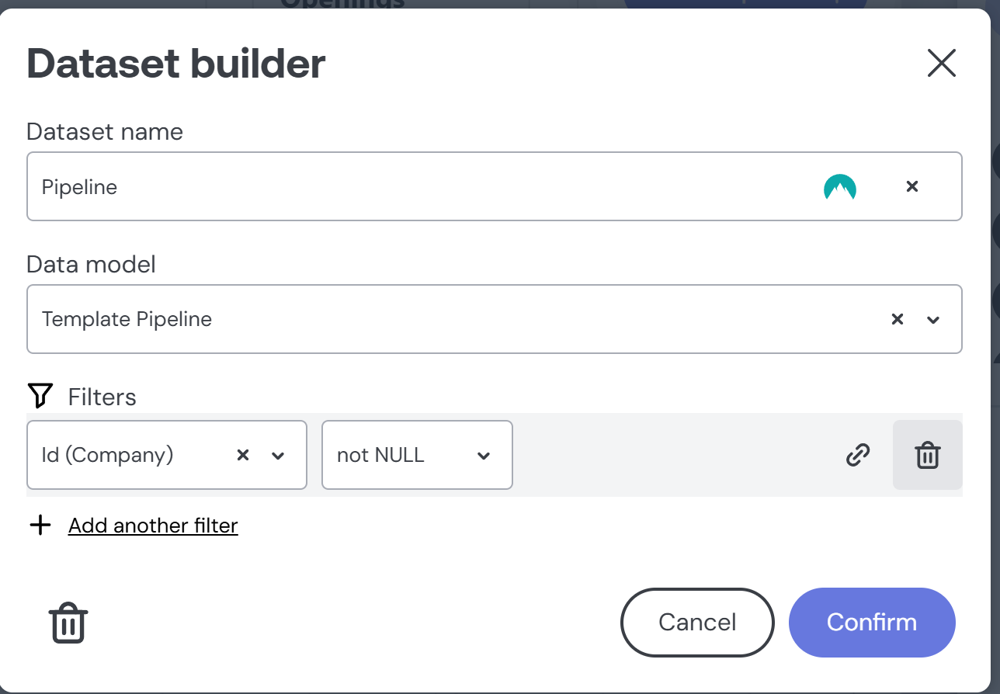

# vanilla-components fork of Embeddable.com tailored for Scalis requirements

### Prerequisites

1. Head to https://github.com/embeddable-hq/vanilla-components to understand how to setup project
2. Read `/src/scripts/README.md` to understand how to setup environment variables and tests connections
3. Explore [Embeddable Handbook](https://trevorio.notion.site/Embeddable-Handbook-2e609adec9fd486b9b58377519540194) and [Embeddable Documentation](https://docs.embeddable.com/)
4. Explore [Cube.js Documentation](https://cube.dev/docs) to understand how to work with CUBE

### Working with the project

1. Database tables and relations are defined in `/src/models/cubes`
2. Every and all queries must join with `companyId` to ensure data isolation between companies. As of 20/02/2025, Embeddable is yet to support features such as `fragments` or `queryRewrite`. To achieve data isolation, following steps are required:

3. employ dynamic SQL generation in `company.cube.yml`:

```sql
SELECT * FROM "Company"
      
        WHERE "Company"."id" = '{ COMPILE_CONTEXT.securityContext.companyId }'
      
        WHERE 1 = 1
      
```

4. Ensure that every query execution joins with `Company` table by adding a filter below to every dataset to be used in https://app.us.embeddable.com/en/workspace/${workspaceId}
   

5. A `securityContext` is being properly sent on the client/consumer similar to [Scalis frontend integration](https://github.com/scalis-io/scalis-io/blob/main/src/app/company/analytics/%5Bid%5D/page.tsx)

```ts
const securityContext = { companyId: session?.user.workspace?.currentCompany.id }
```
